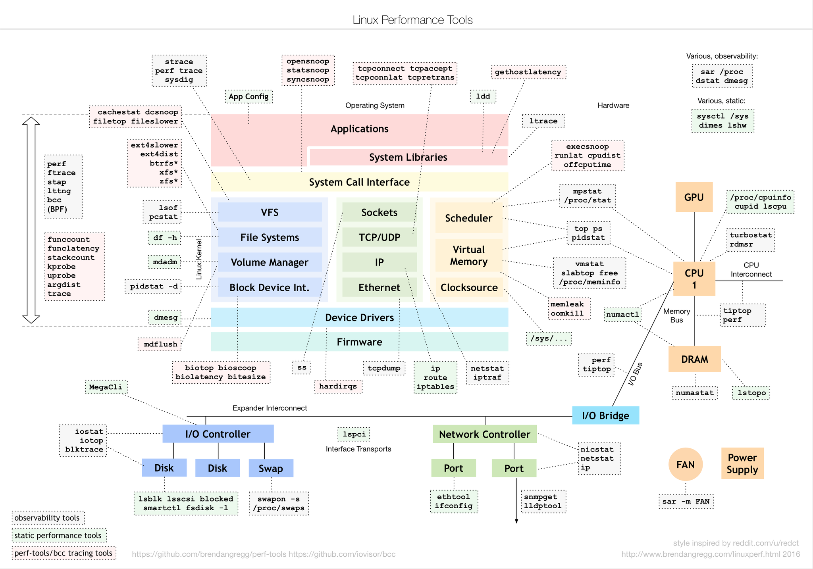
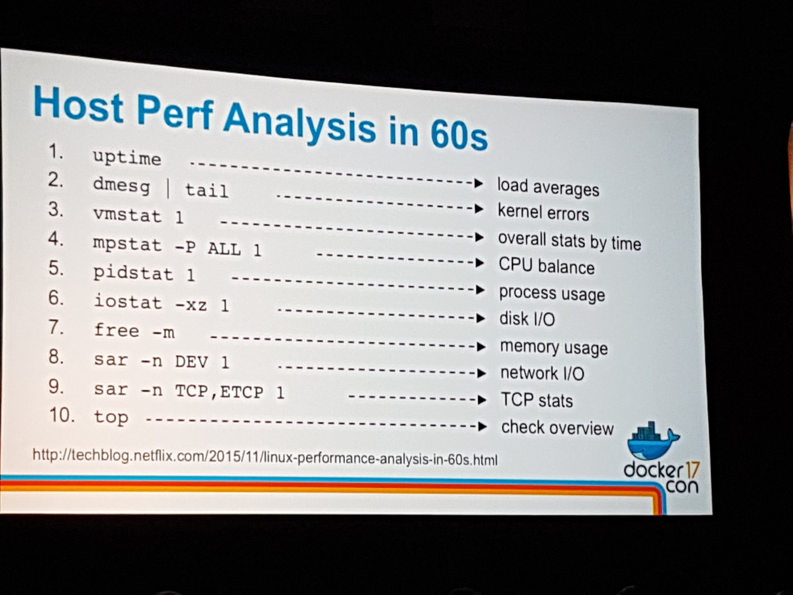

# Linux

## GPIO

### Export pin

```
echo 2 > /sys/class/gpio/export
```

### Set pin

```
echo "out" > /sys/class/gpio/gpio2/direction
echo 1 > /sys/class/gpio/gpio2/value
echo 0 > /sys/class/gpio/gpio2/value
```

### Read pin

```
echo "in" > /sys/class/gpio/gpio2/direction
cat /sys/class/gpio/gpio2/value
```

### Verify using debugfs

```
mount -t debugfs none /sys/kernel/debug
cat /sys/kernel/debug/gpio
```

## Performance Tools



## Performance Analysis



## BPF Performance Tools


- http://www.brendangregg.com/bpf-performance-tools-book.html
